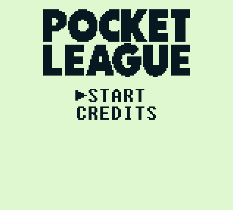
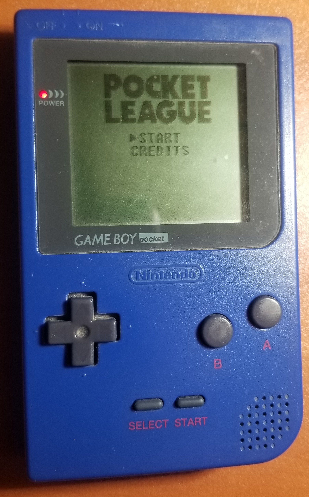
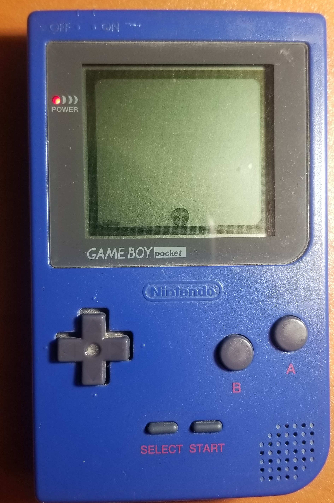

# gb-pocket-league


A work-in-progress port of [Rocket League](https://www.rocketleague.com/) to the GameBoy (Pocket)!

```
What a save!
What a save!
What a save!

(README disabled for 3 seconds.)
```

Inspired heavily by [Rocket League Sidewipe](https://www.rocketleague.com/news/announcing-rocket-league-sideswipe-for-mobile/). Written (poorly) in C using [GameBoy Development Kit 2020](https://github.com/Zal0/gbdk-2020).

## Features

* Works on real GameBoy hardware (especially the Pocket!) as well as emulators
* Most Rocket League functionality ported -- boosts, air rolls, pinching. No demos, sorry :(
* CPU AI
* Scoring with win conditions

## Work In Progress

* Sound
  * BGM
  * Car sound effects
* Bugs
  * Some wraparound effects from pushing ball out of bounds (i.e. ceiling)
  * CPU car can get stuck in the corner when the ball is inside the car
  * If you find one not listed, [report it!](https://github.com/ty-porter/pocket-league/issues/new)

## Screenshots



<br />




## Get a Copy:

Check out the [latest release](https://github.com/ty-porter/pocket-league/releases).

### Generate Your Own:

#### Windows: 

1. Execute the `make.bat` file
2. This will generate a GameBoy ROM titled `gb_pocket_league.gb`
3. Load into your favorite GB emulator! ([BGB](https://bgb.bircd.org/) is preferred).

## Tooling

* [gbdk-2020](https://github.com/Zal0/gbdk-2020) - GameBoy Development Kit - A C library for homebrew game development
* [GBTD](http://www.devrs.com/gb/hmgd/gbtd.html) - GameBoy Tile Designer
* [GBSoundDemo](https://github.com/Zal0/GBSoundDemo) - A replacement for the broken `sound` example in GBDK
* [GBTDG](https://github.com/chrisantonellis/gbtdg/) - Gameboy Tile Data Generator
* [Beepbox](https://www.beepbox.co/) - Simple chiptune sound designer

## Contact

Tyler Porter

tyler.b.porter@gmail.com
